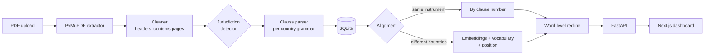

# Regulation Diff — Fire Safety Standards

Clause-level comparison of fire safety regulations, across editions **and across
jurisdictions**. Upload two PDFs — or pick two from the reference collection —
and the system aligns their clauses, marks every word that changed, and lets an
auditor jump straight to the ones that mention a given term.

Built for England & Wales, Scotland, Northern Ireland, and the Republic of
Ireland, with a parsing profile per publishing tradition. Adding another
jurisdiction is a data change, not a code change.

---

## What it does

| | |
| :--- | :--- |
| **Word-level redline** | Every clause pair is diffed word by word. Text the new edition removed is struck through in red; text it added is underlined in green — the way an amendment is marked up on paper. |
| **Multi-jurisdiction** | Documents are scoped to a jurisdiction, and the clause parser switches grammar to match: `2.14` in an Approved Document, `Standard 2.9` in a Scottish handbook, `E1` in a Technical Booklet, `Annex A` in a British Standard. The jurisdiction is detected from the document's own text when the uploader does not state it. |
| **Cross-country comparison** | Compare an English Approved Document against a Scottish Technical Handbook. Where the numbering schemes are unrelated, clauses are matched on meaning, technical vocabulary, and reading position instead of on their numbers. |
| **Instant keyword search** | Type `door` and the comparison filters to the clause pairs that mention it, with every hit highlighted in both panes. A second scope searches every stored edition at once. |
| **The change spine** | A minimap of the whole comparison down the left edge, coloured by what happened where. Click any segment to jump to it. |
| **Reference collection** | A checklist of the official standards this project validates against, with a fetcher that downloads every openly published one. |
| **CSV export** | The full comparison as a spreadsheet, including word counts and match confidence. |

---

## Architecture



**Python service** — ingestion, storage, comparison, served over HTTP by FastAPI.
**Next.js dashboard** — the interface, proxying `/api/*` to the Python service so
the browser sees one origin.

---

## Setup

### 1. Python service

```bash
python -m venv venv
venv\Scripts\activate          # macOS/Linux: source venv/bin/activate
pip install -r requirements.txt
```

The sentence-transformer model (~90 MB) downloads on the first comparison.

### 2. Reference corpus (optional but recommended)

```bash
python -m corpus.fetch --extract   # download the standards, extract text
python -m corpus.load              # parse them into the database
```

This collects 19 openly published documents (~110 MB) across four jurisdictions
and loads roughly 7,000 clauses, so the dashboard has real material on first
run. See [Reference collection](#reference-collection) for what is included.

### 3. Run both halves

```bash
# Terminal 1 — API on :8000
uvicorn api.main:app --reload --port 8000

# Terminal 2 — dashboard on :3000
cd web
npm install
npm run dev
```

Open **http://localhost:3000**.

---

## Using it

### Comparing two editions

Pick a baseline and a revision, then **Compare**. Clauses that share a number
are paired on their number; the summary reports how many are unchanged, lightly
edited, significantly changed, added, or removed. Click a tally to isolate that
category.

### Comparing two countries

Pick editions from different jurisdictions. The engine switches to semantic
alignment automatically, and the summary reframes itself: *aligned*, *diverging*,
and *only in EW* / *only in SC*, because "unchanged" is not a meaningful reading
when the two documents were never the same text.

Each matched row shows both clause numbers (`Requirement B5 → 2.0.5`) plus a
match confidence, so a questionable pairing is visible rather than implied.

Force a strategy with **Clause matching** if you disagree with the automatic
choice.

### Searching

Press <kbd>/</kbd> or click the search box.

- **This comparison** filters the clause pairs on screen as you type and
  highlights every hit in both panes.
- **Whole library** searches all stored clauses in every edition, filtered by
  jurisdiction if one is selected.

### Adding documents

**Add documents** takes any PDF. Leave the jurisdiction on *Detect from the
document* unless you know better. Give two uploads the same document name to
group them as editions of one instrument — though any two stored editions can be
compared regardless.

---

## Reference collection

Run `python -m corpus.fetch --status` for the current checklist.

**England & Wales** — Approved Document B, Volumes 1 and 2: the 2019 edition as
first published, the 2019+2020+2022 consolidation, and the current
2019+2020+2022+2025 text collated with the 2026 and 2029 amendments. All six
amendment booklets (2020, 2022, 2024, 2025, 2026, 2029) and Circular 01/2025.

**Northern Ireland** — Technical Booklet E, Fire safety, October 2012 (with a
mirror copy).

**Republic of Ireland** — Technical Guidance Document B: the 2006 edition as
amended 2020, Volume 2 (dwelling houses) 2020 reprint, and the 2024 Volume 1.

**Scotland** — Building Standards Technical Handbooks 2022, domestic and
non-domestic. Section 2 of each is the fire section.

**British Standards** — BS 9999:2017, BS 9991:2024, and BS 7974:2019 are listed
in the registry but **cannot be downloaded**: BSI sells them under copyright and
the registry links to the publisher rather than to a file. Buy or license a copy,
save it into `corpus/raw/` under the filename shown in the checklist, and it will
register as held and can be ingested like any other PDF.

---

## Evaluation

The comparison engine is measured against ground truth it cannot influence, not
against its own output.

```bash
python -m evaluation.run all           # accuracy, evolution, cross-country
python -m evaluation.run accuracy      # just the accuracy studies
```

Results land in `evaluation/results/*.json`; the write-up is in
[RESEARCH_FINDINGS.md](RESEARCH_FINDINGS.md).

**Where the ground truth comes from.** MHCLG publishes an amendment booklet for
every revision of Approved Document B, naming the paragraphs it changed
(*"Paragraph 10.14, delete the second note"*). `evaluation/amendment_key.py`
parses those registers into clause references, giving an authoritative record
of what changed, written by the body that changed it. Within one instrument,
clause numbers give a second reference: a correct pairing, free. Constructed
edits on real clauses give a third.

Headline results: **8/8 published amendments detected**; semantic alignment
recovers clause-number pairings at **F1 0.859**; **16.8%** of corpus clauses
exceed the encoder's 256-token window, a blind spot the evaluation found and
the word-evidence guard now covers.

**Manual annotation.** Severity — whether an edit is minor or significant — is a
judgement no document settles, so it needs a person:

```bash
python -m evaluation.run annotate --size 150
# label evaluation/annotations/*.csv by hand, following PROTOCOL.md
python -m evaluation.run score-annotations --sheet evaluation/annotations/adb_v1_2019_vs_2025.csv
```

The sheet is blind: it holds the clause texts and empty label columns, while
the system's predictions go to a separate key joined after labelling. Scoring
reports per-class precision and recall, Cohen's κ, and an itemised disagreement
list.

---

## Project structure

```
├── api/                    FastAPI service
│   ├── main.py               endpoints: meta, versions, ingest, compare, search
│   └── schemas.py
│
├── ingestion/              PDF → clauses
│   ├── extractor.py          PyMuPDF, column-aware block ordering
│   ├── cleaner.py            headers, contents pages, page numbers
│   ├── profiles.py           per-jurisdiction clause grammars + detection
│   ├── clause_parser.py      line-by-line splitting into clause records
│   └── pipeline.py           one call from bytes to stored-ready clauses
│
├── comparison/             the diff engine
│   ├── alignment.py          identifier and semantic clause matching
│   ├── diff.py               word-level redline, HTML-escaped
│   ├── engine.py             orchestration and change classification
│   └── report.py             report shape and CSV rows
│
├── database/               SQLite via SQLAlchemy
│   ├── models.py             Document → Version → Clause
│   ├── migrate.py            additive migrations, run on every start
│   └── operations.py         reads, writes, corpus search
│
├── corpus/                 the reference collection
│   ├── registry.py           the standards and where they come from
│   ├── fetch.py              downloader and extractor
│   └── load.py               parse the corpus into the database
│
├── evaluation/             measuring the engine against external ground truth
│   ├── amendment_key.py      parse MHCLG amendment registers into clause refs
│   ├── metrics.py            precision, recall, F1, confusion, Cohen's kappa
│   ├── experiments.py        accuracy studies E1–E3b
│   ├── evolution.py          patterns in regulation evolution
│   ├── cross_country.py      cross-jurisdiction comparison challenges
│   ├── annotation.py         blind sampling + scoring for manual annotation
│   └── run.py                CLI
│
├── web/                    Next.js dashboard
│   ├── app/                  layout, page, design system
│   ├── components/           masthead, pickers, spine, clause records
│   └── lib/                  API client, types, sanitisation, change styling
│
└── config.py               jurisdictions, thresholds, alignment weights
```

---

## How clauses are matched

Two editions of one instrument share a numbering scheme, so matching on the
clause number is exact and free. Two countries' regulations share nothing but
subject matter, so those are matched on a composite score:

```python
score = 0.72 * embedding_similarity     # what the clause means
      + 0.18 * vocabulary_overlap       # "door", "sprinkler", "600mm"
      + 0.10 * relative_position        # regulations follow similar order
```

Vocabulary overlap is there because an encoder will happily rate *600mm* and
*750mm* as near-identical; position is there because both documents work through
escape, then spread, then access, in roughly that order.

Only the top 12 candidates per clause are scored, then resolved into a one-to-one
assignment — optimally where the problem is small enough, greedily where it is
not. A pair scoring below `ALIGN_ACCEPT_THRESHOLD` is reported as two unmatched
clauses rather than a bad pairing.

A cross-jurisdiction comparison always uses semantic alignment, however well the
numbers happen to coincide: `2.1` means different things in Edinburgh and London.

Tune any of this in `config.py`.

---

## Notes on the redline

The comparison service escapes clause text before marking it up, so the HTML it
returns contains only the `<del>` and `<ins>` tags it wrote itself. The client
re-checks that with an allowlist before injecting anything, dropping any tag that
is not one of the three the interface uses. Clause text comes from arbitrary
uploaded PDFs, so both gates have to fail for markup to reach the page.

---

## Configuration

`config.py` holds everything worth changing:

```python
DEFAULT_MODEL_KEY = "bge"           # BAAI/bge-base-en-v1.5, 512-token window

UNCHANGED_THRESHOLD = 0.95          # at or above this → Unchanged
MINOR_EDIT_THRESHOLD = 0.80         # 0.80–0.94 → Minor Edit, below → Significant

# The redline overrides the embedding when they disagree, in both directions.
MAX_UNCHANGED_WORD_RATIO = 0.05     # above this, never "Unchanged"
MIN_SIGNIFICANT_WORD_RATIO = 0.35   # above this, never a "Minor Edit"

CHUNK_WORDS = 220                   # long clauses are chunked, not truncated
MIN_CLAUSE_CHARS = 60               # shorter fragments fold into the clause above
ALIGN_ACCEPT_THRESHOLD = 0.42       # below this, clauses stay unmatched
```

### Choosing the embedding model

**In the dashboard**, pick one from **Comparison model** in the compare bar.
The choice applies to that comparison and to its CSV export, and the report
records which model produced it — scores from different encoders are not
comparable, so changing the model after a comparison shows a notice rather than
silently mixing them.

| Key | Model | Window | Dim | Download |
| :--- | :--- | ---: | ---: | ---: |
| `mini` | all-MiniLM-L6-v2 | 256 | 384 | 90 MB |
| `mpnet` | all-mpnet-base-v2 | 384 | 768 | 420 MB |
| **`bge`** *(default)* | **BAAI/bge-base-en-v1.5** | **512** | **768** | **440 MB** |
| `bge-lg` | BAAI/bge-large-en-v1.5 | 512 | 1024 | 1.34 GB |

A model that is not on disk is downloaded on first use; the picker says so and
shows the size, so a first comparison on a new model does not look like a hang.
Encoders are cached and at most `MAX_LOADED_MODELS` (2) stay resident, so
switching back and forth does not reload or exhaust memory.

**Elsewhere**, set `FIRE_SAFETY_MODEL` to a key or any Sentence-Transformer id:

```bash
FIRE_SAFETY_MODEL=mini uvicorn api.main:app --port 8000     # default for the API
FIRE_SAFETY_MODEL=mini python -m evaluation.run accuracy    # reproduce older figures
```

Window size matters more than raw quality here: regulation clauses are long,
and a clause the encoder cannot read whole is a clause whose later half is
invisible to it. Clauses longer than the window are chunked and pooled
regardless of model, so the window governs how much pooling is needed rather
than whether text is read at all.

Relevant endpoints: `GET /api/models` (registry with download and residency
status), `POST /api/models/warm?model=<key>` (load one ahead of time).

Adding a jurisdiction means adding an entry to `JURISDICTIONS` and a
`ParserProfile` in `ingestion/profiles.py`. Nothing else needs to know.

---

## Troubleshooting

| Problem | Fix |
| :--- | :--- |
| Dashboard says it can't reach the service | Start the API: `uvicorn api.main:app --port 8000`. |
| `ModuleNotFoundError: No module named 'fitz'` | `pip install PyMuPDF` — the import name differs from the package name. |
| "No text could be read from …" | The PDF is a scan. Run OCR over it first; the extractor reads text layers, not images. |
| Very few clauses parsed | The document may not use numbered clauses, or the wrong jurisdiction was selected. Re-upload with the jurisdiction set explicitly, or leave it on *Detect*. |
| First comparison is slow | The embedding model downloads and loads once. Later comparisons reuse it. |
| Cross-country comparison shows nothing unchanged | Expected. No two national regulations are word-identical; read the *aligned* and *diverging* counts instead. |
| A downloaded standard fails to fetch | Regulators move files. `corpus/registry.py` holds the URL for each one — update it there. |

---

## Licence

Provided for research, verification, and academic use. The documents it fetches
remain under their publishers' terms: UK and Irish government guidance is
published under the Open Government Licence or its Irish equivalent; British
Standards are copyright BSI and are not redistributed here.
