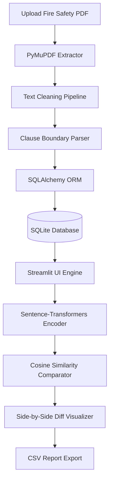

# 🔥 Fire Fighter Document Version Check

An AI-powered system designed for tracking, parsing, and comparing revisions of Fire Safety documents and building codes. By leveraging **Sentence-Transformers**, this tool goes beyond simple text-diffs to detect semantic changes across editions—even when the clauses have been completely rephrased.

---

## 📋 Table of Contents

- [✨ Key Features](#-key-features)
- [🏗 System Architecture](#-system-architecture)
- [🛠 Tech Stack](#-tech-stack)
- [📦 Prerequisites](#-prerequisites)
- [🚀 Installation & Setup](#-installation--setup)
- [⚡ Quick Start](#-quick-start)
- [📖 Operating Manual](#-operating-manual)
  - [1. Uploading & Ingesting Documents](#1-uploading--ingesting-documents)
  - [2. Comparing Versions](#2-comparing-versions)
  - [3. Reading the Results](#3-reading-the-results)
  - [4. Exporting Reports](#4-exporting-reports)
- [📁 Project Structure](#-project-structure)
- [⚙ Configuration & Customization](#-configuration--customization)
- [🔧 Troubleshooting](#-troubleshooting)
- [📄 License](#-license)

---

## ✨ Key Features

| Feature | Description |
| :--- | :--- |
| **Robust PDF Ingestion** | Extracts clean text from complex Fire Safety PDFs, handling multi-column layouts and headers/footers. |
| **Smart Text Cleaning** | Performs Unicode normalization, whitespace standardization, and pattern-based header/footer removal. |
| **Automated Clause Parsing** | Automatically identifies and partitions text into separate clauses using hierarchical section numbering patterns. |
| **Relational Version Tracking** | Utilizes an SQLite database managed with SQLAlchemy ORM to track Documents, Versions, and Clauses. |
| **AI-Powered Semantic Diff** | Uses sentence embeddings to detect meaning-preserving rewrites (e.g., *"Must have 2 exits"* matches *"Two exits are mandatory"*). |
| **Interactive Dashboard** | A fully responsive, modern Streamlit UI with side-by-side color-coded clause diffs and similarity badges. |
| **Granular Change Filtering** | Filter view by *Unchanged*, *Minor Edit*, *Significant Change*, *Added*, or *Removed* clauses. |
| **CSV Export** | Generate and download comprehensive comparison spreadsheets for offline review or compliance reporting. |

---

## 🏗 System Architecture

The following diagram illustrates the ingestion pipeline and comparison workflow:



---

## 🛠 Tech Stack

- **Python 3.10+** — Core development language
- **Streamlit** — Web dashboard and user interface
- **PyMuPDF (fitz)** — High-performance PDF parser
- **SQLAlchemy** — ORM for robust database interactions
- **SQLite** — Local persistent database
- **Sentence-Transformers** (`all-MiniLM-L6-v2`) — Multi-sentence semantic embeddings
- **scikit-learn** — Cosine similarity metrics
- **pandas** — Data structure manipulation and CSV exportation

---

## 📦 Prerequisites

- **Python 3.10 or higher** installed on your system.
- **pip** (Python package installer).
- **Internet connection** for the first run (only) to download the pre-trained Sentence-Transformer model (~90 MB).
- Approximately **500 MB** of free disk space.

---

## 🚀 Installation & Setup

### 1. Clone or Navigate to Project Directory
Ensure you are in the project folder:
```bash
cd "Fire Fighter Document Version Check"
```

### 2. Set Up a Virtual Environment (Recommended)
Creating a virtual environment isolates dependencies:

*On Windows:*
```bash
python -m venv venv
venv\Scripts\activate
```

*On macOS / Linux:*
```bash
python -m venv venv
source venv/bin/activate
```

### 3. Install Dependencies
Install all required packages from `requirements.txt`:
```bash
pip install -r requirements.txt
```

> **Note:** On your first run, the system will automatically download the `all-MiniLM-L6-v2` model from Hugging Face. This will be cached locally for future use.

---

## ⚡ Quick Start

Launch the Streamlit interactive dashboard:
```bash
streamlit run app.py
```

The application will launch and open in your default browser at **`http://localhost:8501`**.

---

## 📖 Operating Manual

### 1. Uploading & Ingesting Documents
Use the **sidebar** to ingest documents and build your local library.

1. Click **Browse files** under **"Choose a Fire Safety PDF"** and upload your document.
2. Enter a **Document Name** (e.g., `National Building Code`). This serves as the root name grouping different revisions.
3. Enter a **Version Label** (e.g., `2016 Edition` or `2024 Revision`).
4. (Optional) Provide a brief **Description** for reference.
5. Click **🚀 Ingest Document**. The system extracts, parses, cleans, and stores the clauses.

> **💡 Pro-Tip:** Upload at least **two versions** of the same document using the **exact same Document Name** but different version labels before attempting a comparison.

---

### 2. Comparing Versions
1. Select the target **Document** from the dropdown menu in the main panel.
2. Select **Version 1 (Baseline)** (usually the older revision).
3. Select **Version 2 (Updated)** (usually the newer revision).
4. Click **⚡ Run Semantic Comparison**. The AI model will calculate semantic similarity scores between all clauses.

---

### 3. Reading the Results

#### Summary Cards
* **Total Clauses:** The unique union of all clause designations.
* **Unchanged:** Similarity score $\ge 0.95$.
* **Minor Edit:** Similarity score between $0.80$ and $0.94$.
* **Significant Change:** Similarity score $< 0.80$.
* **Added:** Clauses introduced in Version 2.
* **Removed:** Clauses deleted from Version 1.

#### Visual Indicators
The comparison display features color-coded cards and badges for quick inspection:
* 🟢 **Green** — Unchanged
* 🟡 **Amber** — Minor Edit
* 🔴 **Red** — Significant Change
* 🔵 **Blue** — Added Clause
* 🟣 **Purple** — Removed Clause

---

### 4. Exporting Reports
Scroll to the bottom of the comparison dashboard to:
1. Preview the comparison matrix in standard tabular format.
2. Click **📥 Download CSV Report** to export the structured results for offline sharing, spreadsheets, or archiving.

---

## 📁 Project Structure

```
Fire Fighter Document Version Check/
│
├── app.py                      # Main entrypoint; handles Streamlit UI and dashboard logic
├── config.py                   # Global configurations, thresholds, and AI model choices
├── requirements.txt            # Package dependencies
├── fire_safety.db              # Local SQLite database (auto-generated)
│
├── ingestion/                  # Extraction and cleaning pipeline
│   ├── extractor.py            #   PyMuPDF wrapper for text extraction
│   ├── cleaner.py              #   Text normalization, header/footer filters
│   └── clause_parser.py        #   Regex-based parser for hierarchical section boundaries
│
├── database/                   # Database models and operations
│   ├── models.py               #   SQLAlchemy ORM models (Document, Version, Clause)
│   ├── db.py                   #   Database connection initialization and session engine
│   └── operations.py           #   Database operations (inserts, lookups, exists checks)
│
└── comparison/                 # AI Similarity engine
    ├── engine.py               #   Sentence-Transformer comparator with cosine similarity
    └── report.py               #   Data models representing semantic change reports
```

---

## ⚙ Configuration & Customization

You can adjust hyperparameters in `config.py`:

```python
# Model choice (compromise between performance and speed)
MODEL_NAME = "all-MiniLM-L6-v2"       # Fast, lightweight model (~90 MB)
# MODEL_NAME = "all-mpnet-base-v2"     # Higher quality, heavier model (~420 MB)

# Semantic similarity thresholds
UNCHANGED_THRESHOLD = 0.95    # Scores above this are marked Green
MINOR_EDIT_THRESHOLD = 0.80   # Scores between 0.80 and 0.94 are marked Amber
                              # Scores below 0.80 are marked Red
```

---

## 🔧 Troubleshooting

| Problem | Explanation / Solution |
| :--- | :--- |
| **`ModuleNotFoundError: No module named 'fitz'`** | Install the PyMuPDF library using `pip install PyMuPDF` (the library name differs from the import statement). |
| **Model download is taking too long** | The Sentence-Transformers model downloads during the first comparison step. Ensure a stable network connection. |
| **No clauses found/parsed** | Confirm your document contains numbered clauses (e.g. `1.1`, `Section 5.3`, etc.). The parser relies on structured text headings to identify clause boundaries. |
| **Comparison is slow** | Typical for documents containing hundreds of clauses. The model is cached in memory, so subsequent comparisons will be faster. |
| **Database is corrupted / locked** | Delete `fire_safety.db` and restart the application; the schema will automatically rebuild. |

---

## 📄 License

This software is provided for research, verification, and academic use. Feel free to modify and adapt it for specific regulatory frameworks.
